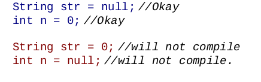
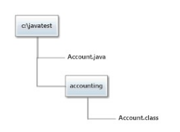
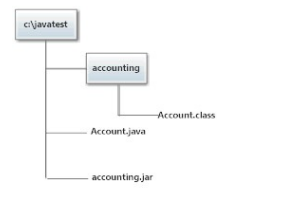

# Chapter 1 Kickstarter for Beginners

## Key points of OOP
### Type, class, enum, and interface
* Type is a nane given to a bahavior.
* A class, an enum, and an interface are types of types
	* A class allows you to combine the description of a behavior and the implementation that is used to realized this behavior
	* An enum allows you to combine the description of a behavior and the implementation that is used to realize this behavior, but in addition provides a fixed number of instancesof this type. You cannot create more  instances of this type.
	* And interface allows you to dfine just the behavior without any implementation. You cannot create instances of an interface.
	* Abstract class, like a class it defeines behavior as well as implementation but the implementation is not complete enough for you to create instances. Like an interface it cannot live as its own.
### Why is something so?
* To help componentize the code: A well-developed software commponent is as generic as possible.
* To eliminate the scope for bugs: Java designers have tried to limit or eliminate features that increase the possibility of bugs in a piece of code. 
* Make life easier for the programmer: having more and more features is not necessarily a good thing. Instead of  focusing on mastering complicated features, the proframmers hsould be spending mmore time in develping business logic.
* To become commercially successful: Java was designed by pragmatic folks rather than idealistic ones. Dome things may not make complete sense from a purely logical or technical perspective but that's how they designed those things anyway.
## Declaration and Definition
Declaration just means that something exists, a definition describes exactly waht it is
```
class SomeClass //class declaration
// class definition starts
{
	public void mi() // method declaration
	// method definition starts
	{
	}
	// method definition ends
}
// class definition ends
```
## 1.4 Object and Reference
### 1.4.1 Relation between a class, an object and a reference
* Object is an instance of a class
* Class defines what the actual object will contain
* To access an object, you need to know exactly wherethat object resides in memory. You need to know the address of an object.a It is this address that is stored in a reference variable
* Primitive variable are the unique variable which store the value of the content and not the reference to it. For example a string variable point to a address direction. The variable just have the address, but not he content of this space of memory. Primary variables as an int stores directly the content of the variable and not point to any other address.
* You cannot make a reference variable point toa memory location directly. You can do that in C/C++ but not in Java.
* You can have as many refeerences to an object as you want.
* A variable which is not pointing at any object is said to be null.



## Static and instance
### Static and Instance
* **Static** for java is not a variable which doesn't move. For that there is **Final**
* **Static** means something that belogs to a class instead of belonging to an instance of that class
* **Static** is considered a non object-oriented feature.
* **Static** it is not an error that you access through a variable of that class, but this is strongly discouraged.
* There are static methods

## Stack and Heap
### Stach and Heap
* When you executea program, the OS allocates and gives memory toa that program
* Once the program the OS gives out a chunk of memory, it is responsability of the program to manage it/
* Once the program ends, this memory is released and goes back to the OS.
* The space for storing the temporary stuff is called **Stack space**
* The space for storing all other stuff is called **Heap space**
* In the stack space variable are store as a stack, when its thread dies its stack space is reverted back to the JVM.
* In the heap space, objects lie in a heap just as they please.
* Whenever any object is crated any where in the code, the JVM allocates space for that object on the heap and puts its contents in the space.
* If there is no reference on any stack space through which an object can be access, that object is considered garbage, and it is cleaned up automatically by the JVM using a garbage collector.
* If you create a variable in a method, whether a reference variable or a primitive variable, it is kept on the stack but when you create an object, that object is stored on the heap.
* Local variablesa re always  kept on the slack. Objects are always stored in the heap
* JVM may have several threads. Each threis given a fixed amount of stack space.
* Heap space is shared among all threads.
* Stack space is limited for a program. To increase to more than 64KB use -Xss.
* Heap space is unlimited from the program's perspective.
* Only temporary varialbles are created on the stack space.
* When a method is invoked by a thread, it uses the thread's stack space to keep its temporary varialbes.
* Variables added to the stack space by a method  are removed from the stack when that method ends.

## 1.7 Conventions
### 1.7.1 Conventions in Java
1. Cases
	* CamelCase for class names
	* lowercar for package names
1. Naming: meaningful
1. Package names: reverse domain name. E.g. com.something.appname

## 1.8 Compilation and Execution
### 1.8.1 Compilation and Execution

* Java sourcefile is compiled into a Java class file an a class file is what isexecuted by the JVM.
* You can organie your Java classes into packages by putting a package statement at the top of a Java source file.
* The package name plus the class name is calle **Fully Qualified Class Name FQCN**
* To compile a class generiting the packages use `javac -d . ClassName.java`
	* -d directs the compiler to create the didrectory structure as per the package name of the class and put the class file in the right place.
	* . tells the ocmpiler that the current directory is the target directory for the resulting output.
* To run you can use `java -classpath . packagename.ClassName`
	* classpath specify where your classes are located. You can specify may locations. 
* Location  is the location of the directory structure of the class file. 

#### Compiling multiple sourcefiles at once

* If you have two classes whre one class depends on the other, you need to compile the source file for theindependent class first and the source file for the dependent class later. 
* It is impractical to determine the sequence of compilation of the source files manually.
* Let the compiler figure out the dependencies by specifying all the source files that you want to compileat once with: 

`javac -d . A.java B.java`

or

`javac -d . *.java`

* if your java source files refer to some preexisting class files that are stored in another directory. use `javac -classpath`

### 1.8.2 Running a single file source 
* You can execute a java main class with `java TestClass.java` 
* Your Java code must not refer to code in any other Java file. 
* You can have as many classes in the file as you want but the first class that apperars in thefile must contain the main method.
* If you see `error: compilation failed` in the console, it is a compilation erro, otherwis, it is an exception durion execution.

### 1.8.3 Packaging classes into Jar
* "Java Archive is a veru much like a zip file but with an extension of jar.
* If you want and structure like this:



within javatest folder  run `jar -cvf accounting.jar accounting`. It tells he jar utility to create accounting.jar file and include the entire directory named accounting in it along with its internal files and directories. You will get this:




You can now run the Account class through `java -classpath ./accounting.jar accounting.Account`

* Jar file allows you to keep information about the contents of the jar file within the jar file itself.
* This information is kepr in the file MANIFEST.MF inside the folder META-INF.
* You can create mymanifest.txt with `jar -cvfm accounting.jar mymanifest.txt accounting`
	* c create
	* v verbose
	* f outputfile
	* m name of the file the contents of which have to be included in the jar's manifest.

### 1.8.4 Compilation error vs exception at run time.
Key points for the exam to avoid confusion
* The compiler's job is to check whether the code folloes the syntactical rules of the language.
* The compiler wants to make sure that the code is logically correct. It can catch some of the errors but not all. Example: `byte b = 200` is not correct for the compiler, but `int i = 10/0` is.
* JVM is the ultimate guard. Unlike the compiler, the JVM knows about everything that te code tries to do an it throws an Exception as soos as it determines that the action may damage the integrity or the the type safety of the JVM. 

## 1.9 Nomenclature
### 1.9.1 Commonly used terms in Java development
* Class -> class, interface, enum.
* Type -> classes, interfces, enums, and also primitive types.
* Primitive types -> byte,char,short,int,long,float,double,boolean
* Reference types -> Classes, Interfaces, Enums
* Top-level reference types 0> Classes, interfaces or enums defines directly under a package
* Nested reference types -> Classes, interfaces and enums defines inside anotherclass, interface, or enum
* Inner reference types -> non static nested classes, interfces and enums
* Local reference types -> nestedreference types that are defined inside amethod.
* Anonymous classes -> just the class definition is present, and the complete declaration is automatically inferred by the compiler. It is never static.
* Compile time vs run time
* Compille-time constants -> constants that the compiler knows because they are never going to change.

## 1.10 Java Identifiers
### 1.10.1 Java Identifiers.
* Names to identify objects, variables, etc.
* Identifier is an unlimited-length sequence of Javaletters and Java digits.
* An idetifier cannot have the same spelling as a Java keyword or literal.


